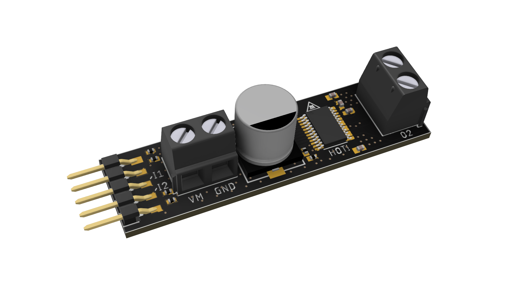
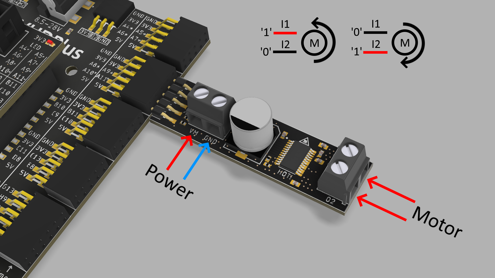

This module enables you to control a DC motor and is ideal to be used for a robot. With the motor driver, you can turn the motor forward and backward at any speed. If your motor has an encoder you can see how far you drove and how fast the motor is spinning.

**Important:**<br>
**THE BOARD GETS HOT AT HIGH CURRENT!**<br>
**DON'T SUPPLY A DIFFERENT VOLTAGE WITH THE SCREW TERMINAL IF CONNECTED WITH 5V!**

## DC Motor Extension


To use the motor, connect the power supply for the motor (note that different motors have different voltage ratings). The motor driver supports 4.5-38V with a maximum of 6A continous and a peak of 10A. You can connect the Motor with the second screw terminal and the encoder with an IO, 3V3 and GND from the [Shield](component_vhdpshield).

## Programming with one motor
### Motor
To control the motor speed, use the Basics/PWM Component in Libraries.

```vhdp
NewComponent PWM_Generator 
(
  CLK_Frequency   => 50000000,          --50 MHz
  PWM_Frequency   => 100000,            --100 KHz
  Bits_Resolution => 8,                 --Speed = 0-255
  Phases          => 1,                 --1 Output

  Reset           => RST,               --Reset
  Enable          => '1',               --Enable
  Duty            => Motor_Speed,       --x"00" to x"FF"
  PWM_Out(0)      => Motor_PWM          --Output
);
```

Connect Motor_PWM to one of the motor outputs and have the different one at '0'. You can set the speed by assigning Motor_Speed to STD_LOGIC_VECTOR(TO_UNSIGNED([Speed], 8));

```vhdp
If(Forward = '1') --should go forward
{
   Motor_B <= '0';
   Motor_F <= Motor_PWM;   --outputs pwm on forward output
}
Else              --should go backward
{
   Motor_F <= '0';
   Motor_B <= Motor_PWM;  --outputs pwm on backward output
}

Motor_Speed <= STD_LOGIC_VECTOR(TO_UNSIGNED(Speed, 8));
```

### Encoder
To see the driven length and the motor speed, use the Extensions/Motor_Encoder Component in Libraries.
You need a motor with an encoder and have to connect the encoder output, 3V3 and GND.

```vhdp
NewComponent Motor_Encoder 
(
   CLK_Frequency       => 50000000,     --50 MHz
   --Used to convert Length and Speed to mm and mm/s
   Holes_In_Disk       => 14,           --Impulses per turn
   Gear_Ratio          => 34,           --1:34
   Wheel_Circumference => 204,          --204mm
   --parameters for length and period time
   Max_Length          => 10000,        --10m
   Time_Invert_Divider => 50,           --for 50MHz -> Time in µs
   Max_Time            => 1000000,      --1s (1.000.000 µs)

   --Inputs
   Encoder_In          => Encoder,      --Encoder Input
   Reset               => RST,          --Reset
   Length_RST          => Length_RST,   --Reset only for length
   --Outputs
   Length              => Length,       --Length output
   New_Length          => New_Length,   --One cycle high on rising edge of encoder
   Time                => Time_Left,    --Period time of encoder edges
   Speed               => Speed_L,      --Driven length in last second
);
```

## Programming with two motors
To drive different routes with two motors, use the Extensions/Motor_Controler Component in Libraries.

```vhdp
NewComponent Motor_Controller 
(
    CLK_Frequency       => 50000000,	--50 MHz

    --PWM parameters
    PWM_Frequency       => 100000,          --100 KHz
    Bits_Resolution     => 8,               --Speed = 0-255

    --Motor Encoder parameters
    Holes_In_Disk       => 1,		--1 to save Logic Elements
    Gear_Ratio          => 1,		
    Wheel_Circumference => 1,			
    --Length is (Drive(n)*Wheel_Circumference)/(Holes_In_Disk*Gear_Ratio)
    --Speed is (Speed*Wheel_Circumference)/(Holes_In_Disk*Gear_Ratio)
    Time_Invert_Divider => 50,              --for 50 MHz -> Time in �s
    Max_Time            => 100000,          --100ms
    Max_Length          => 10000,           --10m

    --Speed correction for straight driving
    Correction_Step     => 1,               --speed correction on period time difference
    Length_Corr_Step    => 25,              --speed correction on length difference
    Max_Length_Diff     => 10,              --Accepted difference for length without correction
	
    --Hardware Inputs
    Reset               => '0',             --Reset
    Encoder_L           => Encoder_L,	--E1 encoder input of first motor
    Encoder_R           => Encoder_R,       --E1 encoder input of second motor
    --Hardware Outputs
    Motor_LF            => ML1,             --M1 of first motor
    Motor_LB            => ML2,             --M2 of first motor
    Motor_RF            => MR1,             --M1 of second motor
    Motor_RB            => MR2,             --M2 of second motor

    --Inputs
    Enable              => Motor_Enable,    --'0' to stop driving and '1' to continue driving
    Reset_Drive         => RST_Drive,       --'0' to reset driven length and '1' to start driving
    Drive_L             => Drive_L,		--Length to drive with left motor
    Drive_R             => Drive_R,         --Length to drive with right motor
    Drive_Speed         => Drive_Speed,     --Speed from 0-255
    --Outputs
    Speed_L             => Speed_L,         --Driven length in last second with left motor
    Speed_R             => Speed_R,         --Driven length in last second with right motor
    Driven_L            => Driven_L,        --Driven length since last reset with left motor
    Driven_R            => Driven_R,        --Driven length since last reset with right motor
    Finished            => Motor_Finished,  --'1' if the Motor drove the given length
    Error               => Motor_Error,     --'1' if the Controller detected that one motor isn't turning (depending on Max_Time)
    Correction          => Motor_Correction,--Speed correction
);
```

Specify the parameters, add the encoder inputs and motor outputs to your Main IOs, create signals for the IOs of the Motor Controller and connect everything like in the example above. Now you can just drive like this:

```vhdp
Thread
{
    If(BTN = '1')            --Button pressed
    {
        Drive_L     <= (1000*Wheel_Circumference)/(Holes_In_Disk*Gear_Ratio);	--drives 1m
        Drive_R     <= (1000*Wheel_Circumference)/(Holes_In_Disk*Gear_Ratio);	--drives 1m
        Drive_Speed <= 230;  --0 to 255
        RST_Drive   <= '1';  --Reset last driven length
        Step                 --Start driving (Step gives Motor controller one cycle to reset values)
        {
            RST_Drive   <= '0';
        }
        While(Motor_Finished = '0' AND Motor_Error = '0'){} --Wait until driving finished or an error appeared 
        While(BTN = '1')     --Wait until button is released if still pressed
        {
            Wait(50000000);
        }
    }
}
```

Also check out our [level shifter](/docs/extension_levelshifter)
 to e.g. add ultrasonic distance sensors to your robot.

 ## Links
* <a href="http://www.ti.com/lit/ds/symlink/drv8871.pdf" target="_blank">Datasheet</a>
