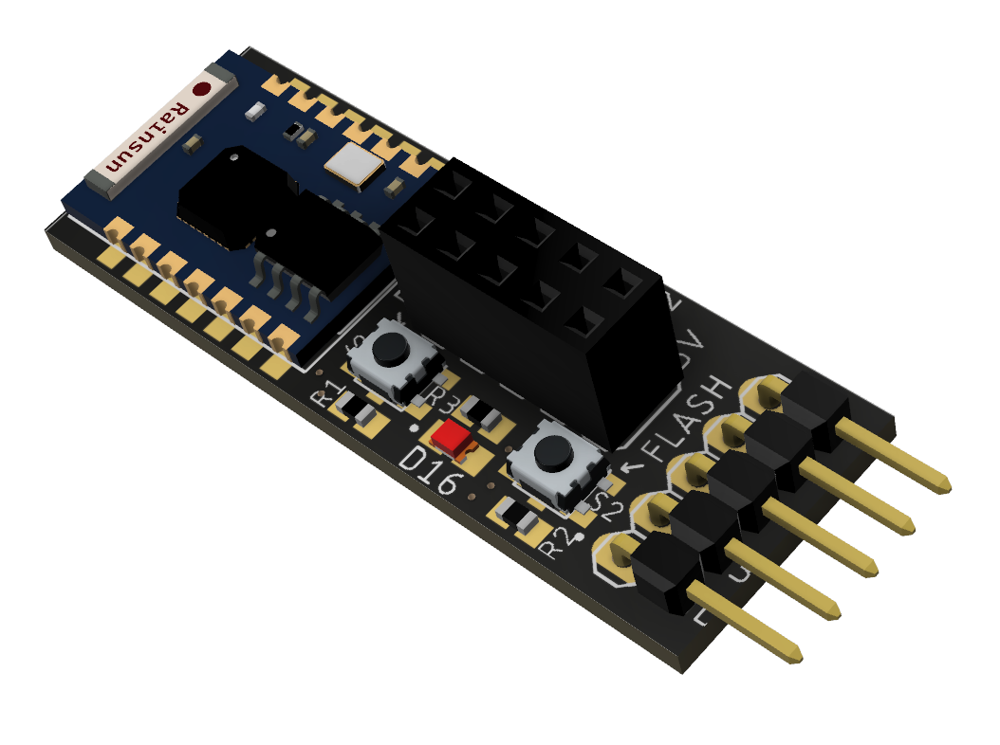
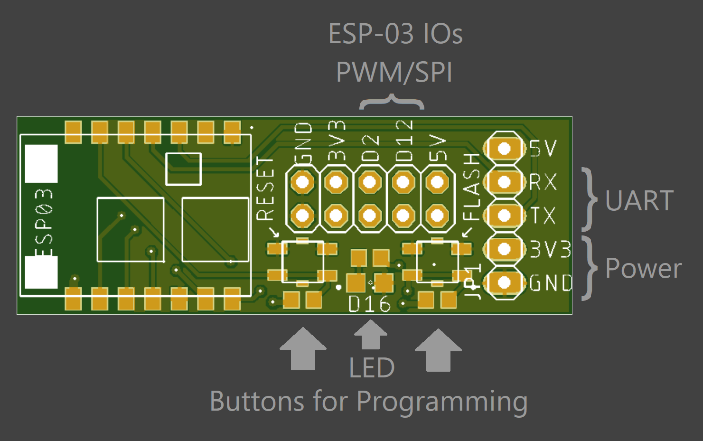
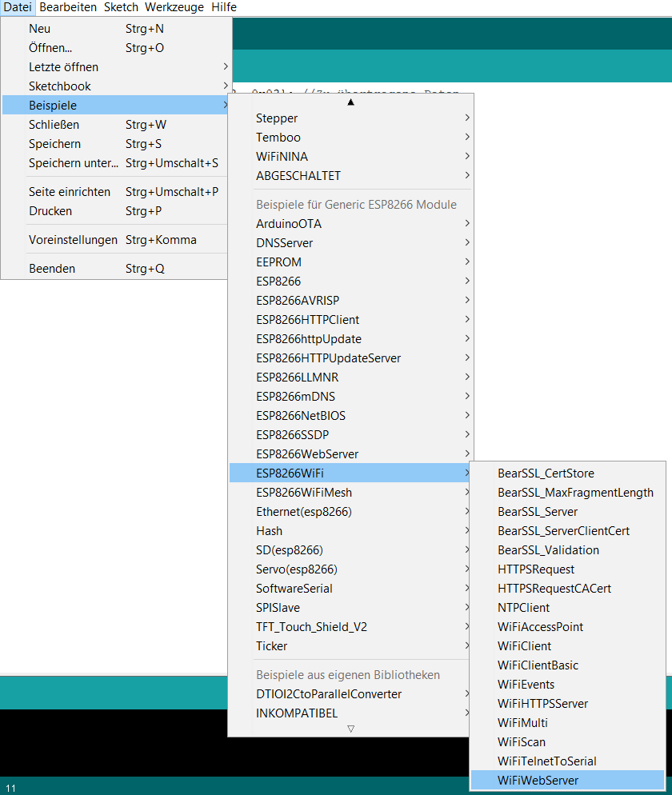

**⚠ THIS DOCUMENTATION IS INCOMPLETE!**



The WiFi Extension Board can be programmed with Arduino, since a normal ESP8266 module is installed, which has a microcontroller integrated.
## Design


* There is a UART interface for data transfer with the FPGA and there are 5 IOs on the module that can be used by the microcontroller, one of which is connected to an LED.
* Unlike normal ESP8266 boards, there are two buttons on the module needed to program the module. So you only need a USB to UART module to program the microcontroller

## Implementation
### Program module
You can use Arduino to program the microcontroller.
* German Tutorial: <a href="https://itler.net/arduino-ide-fuer-die-programmierung-von-esp8266-chips-vorbereiten/" target="_blank">Arduino IDE für die Programmierung von ESP8266 Chips vorbereiten</a>

With a UART interface you can then transfer data between the module and FPGA.
```arduino
byte data[4] = {0x00, 0x01, 0x02, 0x03}; //Data to send

void setup(){
    Serial.begin(115200);   //Configure UART with 115200 Baud
}
void loop(){
    Serial.write(data, 4);  //Send data
    delay(1000);            //Send data again
}
```

The WLAN function can be used as shown in the many examples provided with the library:



Alternatively you can use Blynk:
* <a href="https://www.instructables.com/id/Simple-Led-Control-With-Blynk-and-NodeMCU-Esp8266-/" target="_blank">Simple Led Control With Blynk</a>
* <a href="https://examples.blynk.cc/?board=ESP8266&shield=ESP8266%20WiFi&example=More%2FDHT11" target="_blank">Example</a>

### Communicate with FPGA
To program the module you have to do the following:


You will need an UART Interface to communicate with the FPGA:
```vhdp
--CODE INCOMPLETE
```

