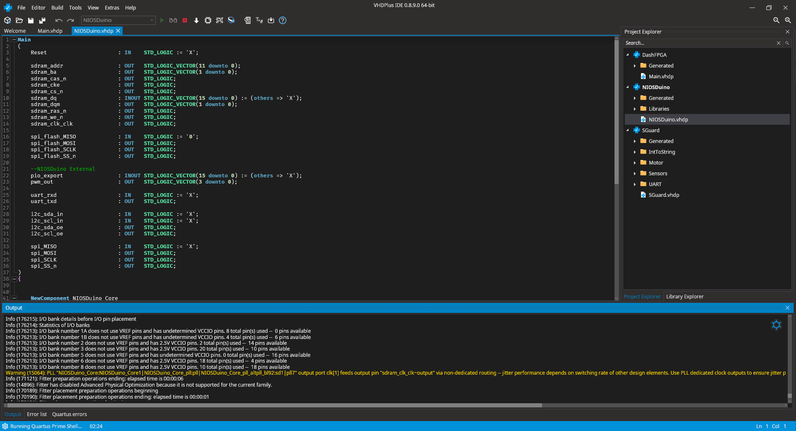

## Setup the IDE

Use the benefits of code suggestions and vendor-independent libraries by using VHDP IDE. The easiest way to program yor FPGA.



### Install VHDP IDE

1. Download <a href="http://download.altera.com/akdlm/software/acdsinst/18.1std/625/ib_installers/max10-18.1.0.625.qdz" target="_blank">MAX 10 device support</a>¹
2. Download and install <a href="http://download.altera.com/akdlm/software/acdsinst/18.1std/625/ib_installers/QuartusLiteSetup-18.1.0.625-windows.exe" target="_blank">Quartus Prime Lite</a> or <a href="http://download.altera.com/akdlm/software/acdsinst/18.1std/625/ib_installers/QuartusLiteSetup-18.1.0.625-linux.run" target="_blank">Quartus Prime Lite for Linux</a>²
3. Choose your version of VHDP IDE according to your operation system:

**Important Notes:**

**VHDP is currently in WIP state. Changes will occur until version 1.0.**
**At this point VHDP IDE does not obtain a Microsoft Certificate. According to that Windows Installer might get blocked by SmartScreen.**

|Operating System| 32 Bit | 64 Bit |
|--|--|--|
| Windows 7+ | {@inject: Win32Download} | {@inject: Win64Download} |
| Debian based (Ubuntu, Linux Mint, ...) | Not supported | {@inject: DEB64Download} |
| RPM based (CentOS, Fedora, OpenSUSE, ...) | Not supported | {@inject: RPM64Download} |
| Other linux | Not supported | {@inject: TAR64Download} |

4. Install the Downloaded VHDP Package:
- **Windows**: Execute the downloaded `.msi` file and follow the steps on the screen.
- **Debian**: Open the downloaded `.deb` file with your built in package manger **OR** install it with the terminal using `$ sudo dpkg –i <PATH TO DOWNLOADED PACKAGE>`
- **RPM**: Open the downloaded `.rpm` file with your built in package manger **OR** install it with the terminal using `$ sudo rpm –i <PATH TO DOWNLOADED PACKAGE>`
- **Other Linux**: Unpack the contents of the `tar.gz` to a location of your choice and execute the `VHDPlus` executable to start the app.


¹MAX 10 device support<br>
The VHDP Core uses a MAX 10 FPGA. Select the device family depending on your development board.

²Quartus Prime<br>
Quartus Prime is necessary for compiling your code and programming your FPGA.

### Drivers

You will need to install the drivers for your programmer in order to download programs to your FPGA. Our [VHDP Core](/docs/component_vhdpcore) has the <a href="https://shop.trenz-electronic.de/de/TEI0004-02-ARROW-USB-Programmer2-fuer-die-Entwicklung-mit-Intel-FPGAs-2-54mm-Header" target="_blank">ARROW USB Programmer 2</a> built in which we recommend because it offers an additional USB to UART interface.<br>
Follow **[this guide](/docs/getstarted_drivers)** to download and install the driver for the **Arrow USB Programmer 2**.

### Connect VHDPlus IDE with Quartus

To be able to compile and program directly from VHDPlus IDE you will need to connect it with Quartus.
**If you installed Quartus in the default directory this should work automatically**.
To change the Quartus path open the VHDPlus IDE and navigate to `Extras -> Options -> General`


If Quartus is detected successfully the border around the Quartus Path will turn green.

### Addional Programs

#### Code Simulation:

1. Download and install <a href="http://download.altera.com/akdlm/software/acdsinst/18.1std/625/ib_installers/ModelSimSetup-18.1.0.625-windows.exe" target="_blank">ModelSim</a> or <a href="http://download.altera.com/akdlm/software/acdsinst/18.1std/625/ib_installers/ModelSimSetup-18.1.0.625-linux.run" target="_blank">ModelSim for Linux</a>
2. Read our instructions [here](/docs/getstarted_modelsim)

## Program with VHDP
Creating a program with the VHDP IDE is simple, but to get you started even faster we've created tutorials and a written instruction:

First program:
<div class="fluidMedia"><iframe id="ytplayer" type="text/html" width="100%" src="https://www.youtube.com/embed/oGBgobUQ0bU?autoplay=0&origin=http://vhdplus.com" frameborder="0" allowfullscreen></iframe></div>

### Create your first program:

Manual:
1. Start the VHDPlus IDE and create a new project (top left). This automatically creates a VHDP file.
2. In the VHDP file, you can write your code. More information about that [here](/docs/getstarted_vhdp). For beginners we recommend to test with this demo code:
```vhdp
/*
Blink example
*/

Main
(
    --I/Os of the FPGA
    LED : OUT STD_LOGIC := '0';  --STD_LOGIC contains states like '1', '0' or 'Z' for High Impedance
)     
{   
    Process Demo ()
    {
        Thread --Every Thread is an endless loop
        {
            LED <= '1';
            Wait(250ms);
            LED <= '0';
            Wait(250ms);
        }
    }
}
```
3. If no errors appeared while analyzing, you can click on the green play icon and a window will open. Here you can connect the in- and outputs from Main with the I/Os of the FPGA (They are labelled on the development board and shield).
4. If an error appeared while compiling, you can double click the error in the Quartus Error list to switch to the file with the error.
5. If compiling has finished (can last up to several minutes, because the compiler tries to find the most efficient way to connect the logic elements), you can program the FPGA. To do that, you can select the `Extras/Settings/Program Type` and press the blue arrow. This should normaly work, but you can press the blue arrow with the gear too to open the quartus program window.

¹MAX 10 device support<br>
The VHDP Core uses a MAX 10 FPGA. Select the device family depending on your development board.

²Quartus Prime<br>
Quartus Prime is necessary for compiling your code and programming your FPGA.
