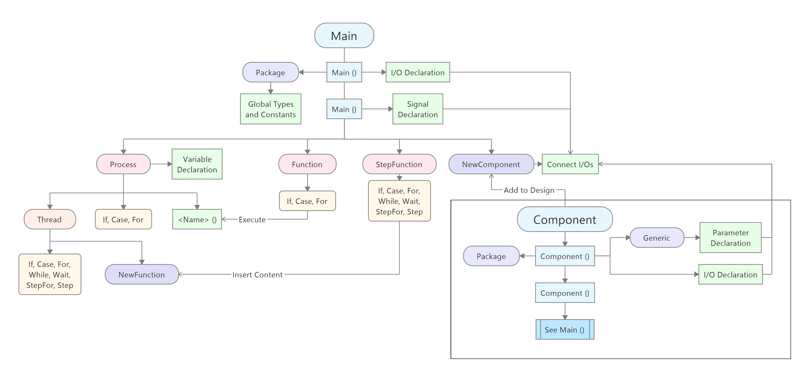

**⚠ THIS DOCUMENTATION IS INCOMPLETE!**

## Overview


More Information: [Click here](/download/VHDP_Overview.pdf)<br>

VHDP is based on VHDL, a programming language that is popular for FPGAs. A big advantage of FPGAs is, that all processes can run simultaneously. Each process is like an endless loop and every CLK cycle the code has to be run through. Therefore, in VHDL there are only If, Case and For, that are usualy used. Also For has to have a definite value of loops, because the operations are only appended to each other to run through in one cycle.

In VHDP the same operations from VHDL are available to be able to use the whole performance. Additionally, you can write Thread{} around a part of the code. This lets you use While and Wait too and the code can run though in more than one CLK cycle. Multiple operations that only need one cycle (e.g. sig <= '1'), are still executed together in one cycle. If you want that some operations are executed one cycle later (e.g. send <= '1'; send <= '0'), you can write Step{} around the code that should be executed one cycle later.

The general structure of a VHDP code looks like this:

```vhdp
Main
(
  FPGAInputName  : IN  STD_LOGIC := '0';
  FPGAOutputName : OUT STD_LOGIC_VECTOR (0 downto 7) := (others => '0');
)
{
  --Global
  SIGNAL SignalName  : STD_LOGIC := '0';
  SIGNAL SignalName2 : STD_LOGIC := '0';

  NewComponent ComponentName
  (
     GenericName => Value,

     ComponentOutputName  => SignalName,
     ComponentInputName   => SignalName2,
  );

  Process Name
  (
    --Local
    VARIABLE VariableName : INTEGER range -128 to 127 := 0;
  )
  {
    If (SignalName = '1')
    {
      FPGAOutputName <= x"FF";   -- Out and Signal with <=
      VariableName   := 0;       -- Variables with :=
    }
  }

}
```

For a Component the structure looks like that:

```vhdp
Component Name
(
  Generic
  (
    ParameterName         : NATURAL := 5; --Parameter like e.g. the CLK frequency
  );
  Package PackageName
  (
    --Here you can create e.g. datatypes (type) for the whole project
    --This makes it possible to have e.g. an array as output
  );
  ComponentInputName  : IN  STD_LOGIC := '0';
  ComponentOutputName : OUT STD_LOGIC_VECTOR (0 downto 7) := (others => '0');
)
{
   --See Main
}
```

While programming you should keep an eye on this:
- Main, Component and Class need an own VHDP file
- Naming:
  - IOs, signals and variables must not be named after a programming module e.g. Wait7, StepIf10, While3...
  - Names of Components, Processes, signals and variables must not have the same name.
- Signals:
  - ... must only be assigned a value in one Process
  - ... will be set in the next cycle and variables instantly
- Outputs cannot be read -> use BUFFER instead if you want to read the current value
- For a comment you have to use -- instead of // (/**/ remains the same)
- The built-in "/" needs a lot of logic elements for big numbers. Use a Mathblock, shift vectors right (num <= '0' & num(7 downto 1) -> num = num/2) or for counters there is a different way:

Instead of
```vhdp
If (stop = '1')
{
  result  <= counter/timeConstant;
}
Else
{
  counter <= counter + 1;
}
```
write this
```vhdp
If (stop = '1')
{
  result  <= counter;
}
Else
{
  If (counter2 < timeConstant)
  {
    counter2 <= counter2 + 1;
  }
  Else
  {
    counter2 <= 0;
    counter  <= counter + 1;
  }
}
```
